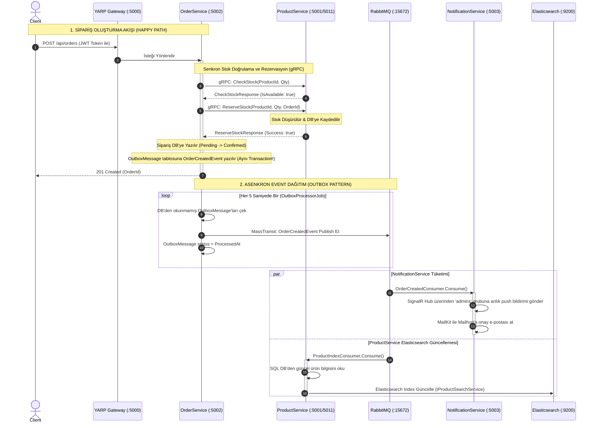
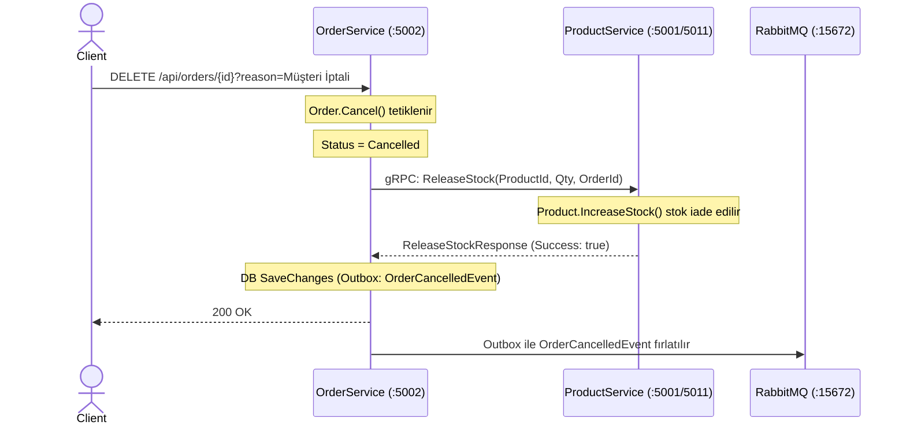

# StockFlow — Uygulama İş Akışı ve Hata Yönetim Kılavuzu 🚀

Bu kılavuz, **StockFlow** mikroservis mimarisindeki iş akışlarını, servisler arası senkron (gRPC) ve asenkron (RabbitMQ + MassTransit) etkileşimleri, hata senaryolarını ve bu hataların nasıl izlenebileceğini (Seq, Jaeger, Kibana, SQL Server) adım adım açıklamaktadır.

---

## 🗺️ Genel Mimari ve İletişim Şeması

StockFlow üzerinde iki tür iletişim modeli kullanılır:
1. **Senkron (Synchronous - gRPC):** Anlık veri tutarlılığı gerektiren kritik işlemler için (örn. stok kontrolü ve rezervasyonu).
2. **Asenkron (Asynchronous - Event-driven / Outbox):** İşlem sonrasında tetiklenen yan etkiler ve bildirimler için (örn. e-posta gönderimi, SignalR bildirimleri, Elasticsearch index güncellemeleri).



---

## 🔄 Senaryolar ve Adım Adım İş Akışı

### 1. Sipariş Oluşturma Senaryosu (`CreateOrderCommand`)

Bir müşteri sepetindeki ürünü onayladığında tetiklenen uçtan uca akış:

```
[İstemci] ──(HTTP POST)──> [YARP Gateway] ──> [OrderService Controller]
                                                      │
             ┌────────────────────────────────────────┘
             ▼ (MediatR Command Dispatch)
[CreateOrderCommandHandler]
             │
             ├──(gRPC Sync)──> [ProductService] ──> (Stok kontrol et & geçici düşür)
             │
             ├──(Local DB)───> [SQL Server (OrderDB)] ──> (Sipariş "Confirmed" olarak eklenir)
             │                       │
             │                       ▼ (EF Core ChangeTracker Interception)
             │                 [OutboxMessages] Tablosuna "OrderCreatedDomainEvent" yazılır
             │
             ▼ (HTTP 201 Created döner)
        [İstemciye Yanıt]
```

#### Çalışan Fonksiyonlar ve Kod Yolları:
1. **API Girişi:** [Gateway](file:///c:/Users/vural/Desktop/StockFlow/src/Gateway) gelen `/api/orders` isteğini YARP route kurallarına göre `OrderService` içindeki `OrdersController`'a yönlendirir.
2. **MediatR Tetikleme:** Controller, gelen DTO'yu [CreateOrderCommand](file:///c:/Users/vural/Desktop/StockFlow/src/Services/OrderService/Application/Commands/OrderCommands.cs#L13) nesnesine dönüştürür ve `_mediator.Send()` ile handler'a gönderir.
3. **gRPC Stok Kontrolü:** [CreateOrderCommandHandler](file:///c:/Users/vural/Desktop/StockFlow/src/Services/OrderService/Application/Commands/OrderCommands.cs#L21), `ProductService` gRPC servisine (`StockGrpc.StockGrpcClient`) iki senkron çağrı yapar:
   - `CheckStockAsync`: [StockGrpcService.CheckStock](file:///c:/Users/vural/Desktop/StockFlow/src/Services/ProductService/API/Grpc/StockGrpcService.cs#L21) fonksiyonu çalışır. Stok yeterli mi kontrol edilir.
   - `ReserveStockAsync`: [StockGrpcService.ReserveStock](file:///c:/Users/vural/Desktop/StockFlow/src/Services/ProductService/API/Grpc/StockGrpcService.cs#L37) fonksiyonu çalışır. `Product.DecreaseStock()` çağrılarak stok azaltılır ve SQL Server'a kaydedilir.
4. **Sipariş Kaydı & Outbox:** Stok başarıyla rezerve edildikten sonra, `Order.Create()` ve `order.Confirm()` fonksiyonları çağrılır. `SaveChangesAsync()` tetiklendiğinde, `OrderDbContext` içindeki `SaveChangesAsync` override'ı devreye girer. Sipariş ve ona bağlı domain event (`OrderCreatedDomainEvent`) **tek bir veritabanı transaction'ı** içinde `Orders` ve `OutboxMessages` tablolarına kaydedilir.
5. **Event Dağıtımı (Outbox):** Arka planda çalışan [OutboxProcessorJob](file:///c:/Users/vural/Desktop/StockFlow/src/Services/OrderService/Infrastructure/Messaging/OutboxProcessorJob.cs#L9) (Hosted Service), her 5 saniyede bir bekleyen mesajları okur. `OrderCreatedDomainEvent`'i asenkron `OrderCreatedEvent` kontratına dönüştürerek RabbitMQ'ya publish eder.
6. **Bildirim Tüketicisi:** [OrderCreatedConsumer](file:///c:/Users/vural/Desktop/StockFlow/src/Services/NotificationService/Consumers/OrderCreatedConsumer.cs#L9) bu event'i RabbitMQ'dan alır:
   - SignalR [StockHub](file:///c:/Users/vural/Desktop/StockFlow/src/Services/NotificationService/Hubs) aracılığıyla `"admins"` grubuna anlık sipariş kartı push eder.
   - `EmailService` aracılığıyla Mailhog SMTP sunucusuna e-posta gönderir.

---

### 2. Sipariş İptal / Kompanzasyon Senaryosu (`CancelOrderCommand`)

Kullanıcı siparişi iptal ettiğinde veya bir hata nedeniyle geri alındığında (Saga Kompanzasyon Adımı):



#### Çalışan Fonksiyonlar ve Kod Yolları:
1. **İptal Handler:** [CancelOrderCommandHandler](file:///c:/Users/vural/Desktop/StockFlow/src/Services/OrderService/Application/Commands/OrderCommands.cs#L81) çağrılır.
2. **Entity State Değişimi:** `order.Cancel(reason)` çalıştırılır. Bu işlem `OrderCancelledDomainEvent` oluşturur.
3. **gRPC Kompanzasyon:** `ProductService` üzerindeki [StockGrpcService.ReleaseStock](file:///c:/Users/vural/Desktop/StockFlow/src/Services/ProductService/API/Grpc/StockGrpcService.cs#L62) çağrılır. Bu fonksiyon `Product.IncreaseStock()` ile stoğu eski haline getirir.
4. **Outbox & Event:** `SaveChangesAsync` ile veritabanı güncellenir ve `OutboxProcessorJob` aracılığıyla `OrderCancelledEvent` RabbitMQ'ya gönderilir.

---

### 3. Elasticsearch Ürün İndeks Senkronizasyonu

Stok hareketleri (azalma/artma) veya yeni ürün ekleme işlemlerinde Elasticsearch verilerinin asenkron güncellenmesi:

```
[Stok Hareketi/Ürün Ekleme]
         │
         ├──> [SQL Server (ProductDB)] ──> (Outbox'a ProductCreated/StockDecreased/StockIncreased yazılır)
                                                  │
             ┌────────────────────────────────────┘
             ▼ (OutboxProcessorJob -> RabbitMQ)
[ProductIndexConsumer.Consume()]
         │
         ├──> SQL DB'den güncel ürün detaylarını oku (FindAsync)
         └──> Elasticsearch Client ──(HTTP PUT)──> [Elasticsearch /products Index]
```

#### Çalışan Fonksiyonlar ve Kod Yolları:
1. **Event Tetikleyici:** `ProductService` içindeki veritabanı değişiklikleri `ProductCreatedDomainEvent`, `StockDecreasedDomainEvent` veya `StockIncreasedDomainEvent` fırlatır.
2. **Consumer:** RabbitMQ'daki bu eventleri [ProductIndexConsumer](file:///c:/Users/vural/Desktop/StockFlow/src/Services/ProductService/Consumers/ProductIndexConsumer.cs#L9) dinler.
3. **Senkronizasyon:** Consumer, veritabanından en güncel ürün kaydını okur ve `IProductSearchService.IndexProductAsync()` üzerinden Elasticsearch sunucusuna (`/products` indexine) Turkish analyzer kullanarak yazar.

---

## 🛠️ Hata ve Problem Çözme Matrisi (Troubleshooting Guide)

Sistemde bir aksaklık olduğunda adım adım nerede, neyi arayacağınızı gösteren rehber:

| Hata Belirtisi | Olası Neden | Kontrol Noktası & Çözüm Yolu |
| :--- | :--- | :--- |
| **Sipariş oluşturulamıyor (500 Internal Server Error)** | Veritabanı (SQL Server) kapalı veya migrasyonlar uygulanmamış olabilir. | 1. `docker ps` ile `sqlserver` container'ının çalıştığından emin olun.<br>2. `docker logs product-service` ve `docker logs order-service` çıktılarına bakın.<br>3. Migrasyonları kontrol etmek için ilgili projelerde `dotnet ef database update` komutunu çalıştırın. |
| **Sipariş oluşturulamıyor (Stok Yetersiz/Rezervasyon Hatası)** | İstenen ürünün stoku yetersiz veya gRPC bağlantısı kurulamıyor. | 1. `ProductService` gRPC portunun (`5011`) açık olduğunu doğrulayın.<br>2. [Seq](http://localhost:5341) arayüzünde ilgili `CorrelationId` ile gRPC hata loglarını (`RpcException`) aratın.<br>3. `OrderService` `appsettings.json` içindeki `Grpc:ProductService` adresini kontrol edin. |
| **Sipariş başarıyla oluşuyor fakat E-posta / SignalR bildirimi gelmiyor** | Outbox Message işlenemedi veya RabbitMQ / NotificationService kapalı. | 1. **SQL Server'da Sorgu Çalıştırın:**<br>`SELECT * FROM OutboxMessages WHERE ProcessedAt IS NULL`<br>Eğer burada satırlar birikiyorsa ve `RetryCount` artıyorsa, `Error` sütunundaki hata mesajını okuyun.<br>2. `docker logs notification-service` komutuyla consumer hata loglarını inceleyin.<br>3. [RabbitMQ Yönetim Paneli](http://localhost:15672) (guest/guest) üzerinden kuyrukların (queues) durumunu ve bekleyen mesajları kontrol edin. |
| **Ürün aramalarında (`/api/products/search`) güncel stoklar görünmüyor** | Elasticsearch indeksleme consumer'ı (`ProductIndexConsumer`) hata alıyor veya Elasticsearch servis dışı. | 1. `docker compose logs elasticsearch` ile Elasticsearch durumunu inceleyin.<br>2. **Elasticsearch Index Mapping Kontrolü:**<br>`curl http://localhost:9200/products/_search?pretty` sorgusuyla indekslenmiş son dokümanları görün.<br>3. Seq üzerinde `ProductIndexConsumer` sınıfına ait filtreleme yapıp logları tarayın. |
| **YARP Gateway istekleri yönlendiremiyor (502 Bad Gateway)** | Hedef mikroservisler ayağa kalkmamış veya yanlış portta çalışıyor. | 1. `Gateway` projesindeki `appsettings.json` YARP cluster adreslerini (`Destinations`) doğrulayın.<br>2. Docker compose veya lokal ortamda ilgili servislerin (`ProductService: 5001`, `OrderService: 5002`) çalışır durumda olduğunu doğrulayın. |

---

## 🔍 İzlenebilirlik Araçları ve Kullanımı (Observability Dashboard)

Hataları bulmak ve performans darboğazlarını tespit etmek için projedeki entegre araçlar:

### 1. Seq (Merkezi Loglama Sistemi) — `http://localhost:5341`
- **Ne işe yarar?** Tüm mikroservislerin `Serilog` üzerinden bastığı yapılandırılmış logları tek bir yerde toplar.
- **Nasıl sorgulanır?**
  - Belirli bir siparişe ait tüm log zincirini görmek için `CorrelationId = 'GUID'` yazarak aratın.
  - Sadece hataları listelemek için arama çubuğuna `?Level = 'Error'` veya `?Level = 'Warning'` yazın.
  - Servis bazlı filtreleme için `Application = 'OrderService'` filtresini kullanın.

### 2. Jaeger (Dağıtık İzleme / Distributed Tracing) — `http://localhost:16686`
- **Ne işe yarar?** Bir HTTP isteğinin Gateway'den başlayıp gRPC üzerinden diğer servislere gidişini, veritabanına sorgu atışını ve RabbitMQ'ya event fırlatışını bir zaman çizelgesi (timeline) üzerinde görselleştirir.
- **Nasıl kullanılır?**
  - Sol menüden `Service` olarak `gateway` seçip `Find Traces` butonuna tıklayın.
  - Kırmızı veya sarı renkli yollar hata almış span'leri (işlemleri) temsil eder.
  - Hatalı span'e tıkladığınızda veritabanı sorgusu (`db.statement`), gRPC durum kodu veya fırlatılan Exception detayları anında görünür.

### 3. Kibana (Elasticsearch Arayüzü) — `http://localhost:5601`
- **Ne işe yarar?** Ürünlerin Elasticsearch üzerindeki indeks yapısını kontrol etmenizi, arama motorunun nasıl çalıştığını analiz etmenizi sağlar.
- **Nasıl sorgulanır?**
  - **Dev Tools** menüsüne giderek:
    ```json
    GET /products/_search
    {
      "query": {
        "match": {
          "name": "laptop"
        }
      }
    }
    ```
    yazıp çalıştırarak full-text arama motoru analizlerini yapabilirsiniz.

### 4. Mailhog (Geliştirici E-Posta Kutusu) — `http://localhost:8025`
- **Ne işe yarar?** Gerçek bir e-posta sunucusuna ihtiyaç duymadan, sistemin gönderdiği tüm sipariş onay ve düşük stok bildirim e-postalarını yakalar ve tarayıcıda görüntüler.

---

> [!TIP]
> **Hızlı Hata Analizi Rutini:**
> 1. İstemcide hata aldığınızda yanıt başlıklarındaki (response headers) `X-Correlation-ID` değerini kopyalayın.
> 2. Bu ID'yi direkt **Seq** (`http://localhost:5341`) arama motoruna yapıştırarak hatanın oluştuğu tam satırı ve exception stack trace'ini bulun.
> 3. Eğer sorun servisler arası gecikme veya zaman aşımıysa, aynı ID'yi **Jaeger** (`http://localhost:16686`) üzerinde aratıp hangi adımda ne kadar milisaniye kaybedildiğini saniyeler içinde tespit edin.
